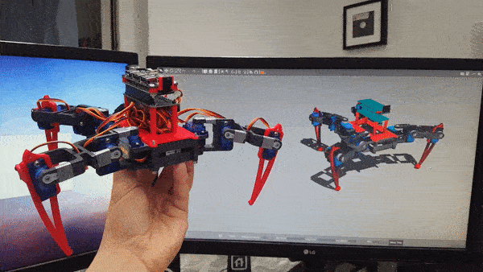
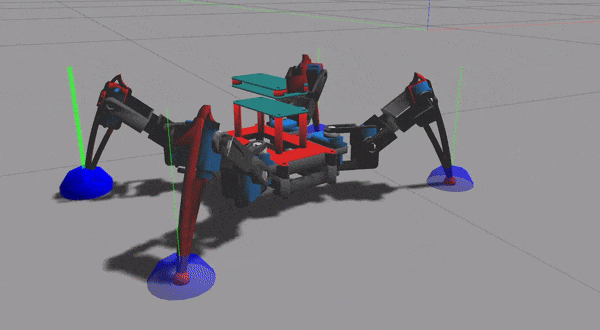

# Open Critter #



## Assembly ##
* The `skp` file can be found in the `sketch` directory. _(modding)_
* Print the `stl` files from `meshes` directory.
* Use the screws provided for the servos and shields.
* No soldering required. _(yet)_

### Components ###
* Raspberry Pi Zero _( or ZeroW )_
  * TL-WN725N WiFi adapter _( optional )_
  * Zero4U USB HUB _( optional )_
* ZeroCam
* Waveshare Servo HAT _( PCA9685 )_
* 8x SG90 1kg/cm servos _( or 12x )_
* 4x MG90 2kg/cm servos _( optional )_
* DC jack terminalblock adapter _( Delock )_
* Tattu 2500mAh / 7.4V LiPo pack _( FatShark battery )_

## Simulation ##

Start the simulation with: `roslaunch open_critter simulation.launch`

#### URDF/Xacro ####

```xml
<!-- urdf/critter.xacro -->
<xacro:property name="use_stand" value="false"/> <!-- put's the robot on a fixed pedestal -->
<xacro:property name="rubber_paw" value="true"/> <!-- adds extra rubber material to the end of each tibia -->

<!-- urdf/leg.xacro -->
<xacro:property name="servo_effort"    value="10"/>
<xacro:property name="servo_velocity"  value="1"/>
<xacro:property name="servo_torque"    value="1.0"/>
<xacro:property name="servo_reduction" value="1.0"/>
```



#### Known issues ####
* PID gains for _PositionJointInterfaces_ are not yet tuned. _(off)_
