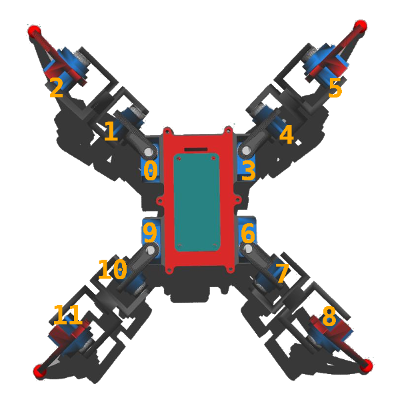
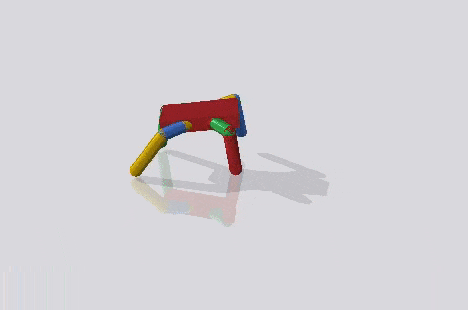

# Open Critter #


## Assembly ##
* The `skp` file can be found in the `sketch` directory. _( this is a modding as well )_
* Print the `stl` files from `meshes` directory.
* Use the screws provided for the servos and shields.
* No soldering required. _(yet)_

### Servo to shield pin mapping ###


### Components ###
* Raspberry Pi Zero _( or ZeroW )_
  * TL-WN725N WiFi adapter _( optional )_
  * Zero4U USB HUB _( optional )_
* ZeroCam
* Waveshare Servo HAT _( PCA9685 )_
* 8x SG90 1kg/cm servos _( or 12x )_
* 4x MG90 2kg/cm servos _( optional )_
* DC jack terminalblock adapter _( Delock )_
* Tattu 2500mAh / 7.4V LiPo pack _( FatShark battery )_


## ROS bridge ##

There is a small datagram server with the I2C driver for the PWM shield in `raspi` directory. Run `make_server.sh` to compile it. The default port for listening to servo commands is `9001`. 

There is a `robot_bridge` node that compiles with the `open_critter` ROS package that subscribes to the individual servo topics and transmits the datagram packets to the server running on the pi zero. `robot.launch` shall start this node as well, the port number is a local parameter, defaults to `9001`.

#### To Do ####

* `robot_bridge` should publish the joint state updates on acknowledgement from the robot. 
* _unfortunately there is no actual position feedback ( later some extra sensors might be needed )_  

## Simulation ##

Start the simulation with: `roslaunch open_critter simulation.launch`

#### URDF/Xacro ####

```xml
<!-- urdf/critter.xacro -->
<xacro:property name="use_stand" value="false"/> <!-- put's the robot on a fixed pedestal -->
<xacro:property name="rubber_paw" value="true"/> <!-- adds extra rubber material to the end of each tibia with a single contact point to ground -->

<!-- urdf/leg.xacro -->
<xacro:property name="servo_effort"    value="1.0"/>
<xacro:property name="servo_velocity"  value="1.0"/>
<xacro:property name="servo_torque"    value="0.5"/>
<xacro:property name="servo_reduction" value="10.0"/>
```

#### Known issues ####
* Model is sliding although motionless.
* PID gains for _PositionJointInterfaces_ are not yet tuned. _(off)_

## OpenAI ##

OpenAI-Gym with Bullet engine, through [pybullet-gym](https://github.com/benelot/pybullet-gym).



##### Prerequisites #####

* `pip3 install gym`
* `pip3 install pybullet`

#### To Do ####

* Environment wrappers to connect *gym* to ROS.